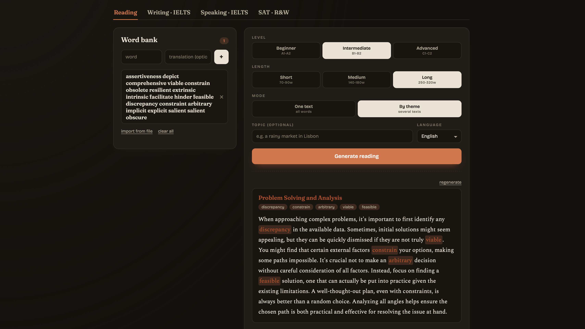
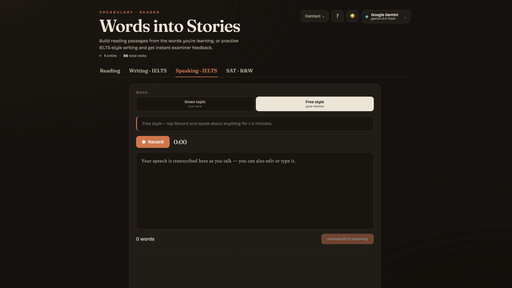

<div align="center">


<br/>

**Build reading passages from the words *you're* actually learning — and get instant IELTS examiner-style feedback on your writing and speaking.**

<br/>

[](https://vocab-reader.fly.dev)


</div>

<br/>

> [!NOTE]
> This repository is a **showcase / write-up** of the project — what it is, why it exists, and how it works under the hood. The app itself lives at **[vocab-reader.fly.dev](https://vocab-reader.fly.dev)** — no install, no signup, just open it.

<br/>

## ✦ The idea

Most vocab apps make you grind flashcards. Most reading practice gives you texts full of words you *don't* care about. I wanted the opposite:

**Type in the words you're learning → get a real passage written around them.** You see your target vocabulary in natural context, tap any word for an instant translation, and actually *remember* it.

Then it grew into a full prep companion — because if you're learning English seriously, you're probably staring down IELTS or the SAT too.

<br/>

## ✦ What it does

### 📖 Reading — passages from your own word bank
Drop in the words you're studying, pick a level (A1–C2) and length, and get a coherent passage that weaves them in. Tap any word for an inline translation. Generate one focused text or a themed set.

### ✍️ IELTS Writing — with band scores
Get a Task prompt, write your response, and receive feedback scored across the four official criteria (Task Achievement, Coherence & Cohesion, Lexical Resource, Grammatical Range & Accuracy) — plus concrete fixes.

### 🎙️ IELTS Speaking — assessed from your actual voice
Record your answer and the app evaluates the **audio itself** — fluency, pronunciation, intonation, lexical range — against the IELTS band descriptors, with a verbatim transcript and specific, honest feedback. Not text analysis pretending to be speech analysis.

### 🎓 SAT — Reading & Writing
Practice SAT-style R&W questions with explanations.

<br/>

## ✦ See it

<div align="center">

<!-- Replace these with real screenshots: drop images in /assets and update the paths -->


<br/><br/>



<sub>📸 Screenshots — swap in your own under <code>/assets</code></sub>

</div>

<br/>

## ✦ How it's built

A deliberately simple stack — one Node server, one vanilla-JS frontend, no build step, no framework bloat.

```
┌─────────────────────────────┐
│   Browser (single HTML +    │
│   vanilla JS, no framework) │
└──────────────┬──────────────┘
               │  fetch /api/*
┌──────────────▼──────────────┐
│   Node.js + Express server  │
│   · prompt orchestration    │
│   · multi-provider failover │
│   · rate-limit & key pool   │
└──────┬───────────────┬──────┘
       │               │
┌──────▼─────┐   ┌─────▼──────┐
│  AI APIs   │   │  Upstash   │
│ (BYO key)  │   │  Redis     │
└────────────┘   └────────────┘
```

Some of the bits I'm proud of:

- **Bring-your-own-key, multi-provider AI** — the server can talk to Gemini, OpenAI, Anthropic, Groq, Mistral, DeepSeek and more. Keys live only in the user's browser; the server just proxies the calls with **automatic failover** between providers.
- **A real key-pool rotator** — for the free trial, a pool of keys is rotated round-robin across *live* keys only, with per-key RPM/RPD budgets, 429 cooldowns, and automatic exclusion + recovery of rate-limited keys.
- **Audio-first speaking assessment** — the recording is normalized and sent to an audio-capable model with a strict examiner prompt, so the band reflects how you actually *sound*.
- **Owner dashboard** — a hidden admin panel with live stats (online now, total visitors, key-pool health, recent visitors with device & location), all backed by Redis so it survives restarts and stays consistent across machines.
- **Resilient by design** — request timeouts everywhere, JSON repair for truncated model output, graceful in-memory fallback when Redis isn't configured.

<br/>

## ✦ Tech

| Layer | What |
|---|---|
| **Frontend** | Single-file HTML + CSS + vanilla JS · literary type (Fraunces / Spectral) · dark mode · zero build step |
| **Backend** | Node.js · Express (ES modules) |
| **Storage** | Upstash Redis (presence, visitor history, trial counters) with in-memory fallback |
| **AI** | Multi-provider proxy with failover · live model loading · audio assessment |
| **Hosting** | Fly.io · Docker |

<br/>

## ✦ Status

Live and actively used for my own IELTS/SAT prep. Built solo as a learning project — feedback and ideas welcome via issues.

<div align="center">
<br/>

**[→ Open the app](https://vocab-reader.fly.dev)**

<sub>Made by <a href="https://github.com/filooww">@filooww</a></sub>


</div>
